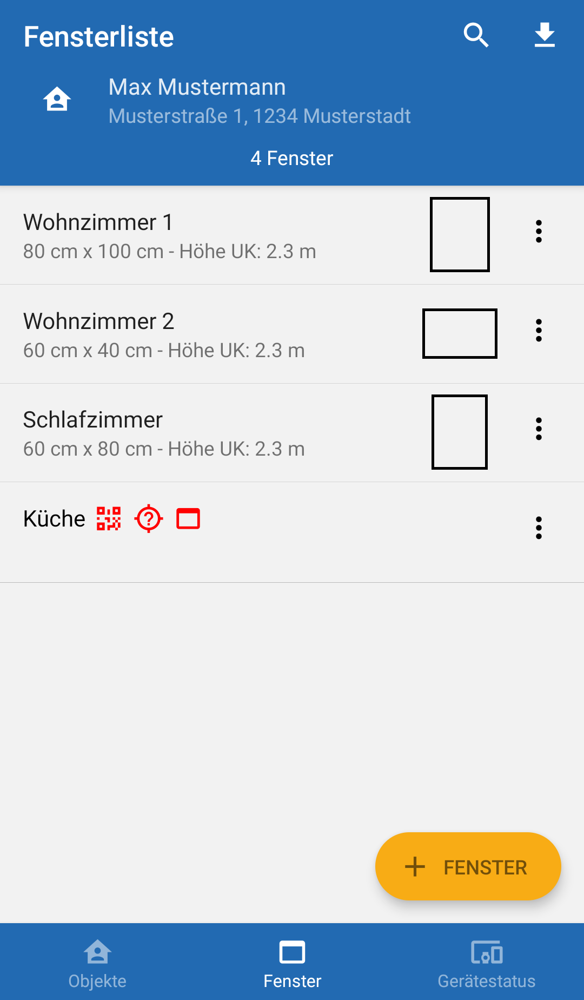
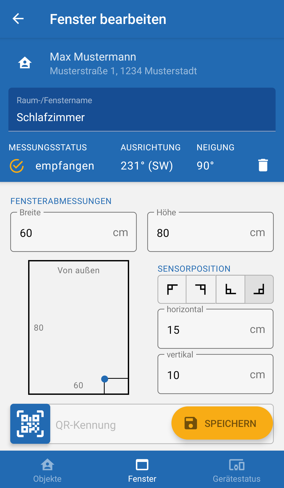
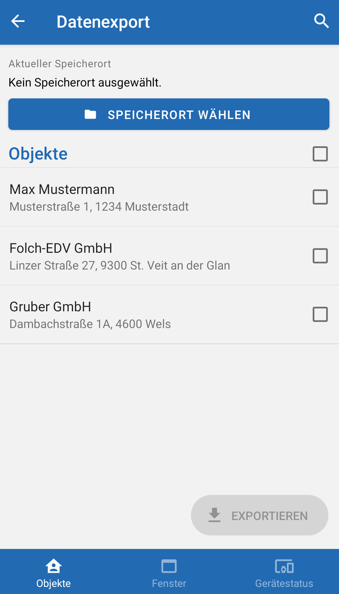

## What is windowManager?
windowManager is an Android app that allows managing measurements of windows in buildings.

It is written in [React Native](https://reactnative.dev/) using the [expo](https://expo.dev/) framework. It uses [React Native Paper](https://reactnativepaper.com/) as a UI library to get a material look and [React Navigation](https://reactnavigation.org/) for Navigation within the app.

#### Features
* Create, edit and delete projects
* Create, edit and delete windows for each project
* QR code scanner to scan in serial numbers
* Connect to a measurement device via bluetooth, initiate, abort and collect measurements
* Export collected data locally to .csv files

## Screenshots

|            window list            |           window creation           |          data export          |
| :-------------------------------: | :---------------------------------: | :---------------------------: |
|  |  |  |

## Build & Launch

Copy the repository and build the app via

```
expo run:android -d
```

If available on the system the choice will be given to install on an Android emulator or a USB-connected Android phone.
If an Android emulator is chosen, Bluetooth functionality won't work and may throw errors. Thus direct testing on an Android device is highly recommended.

The command will build and install a "WindowManager" development app.

Once building is complete the expo development server will start. If not it can be started anytime by running the above command again.
Once the server is running, the app can be opened and loaded on the phone via the `a` keyboard shortcut.

For directly building an .apk see the expo [build page](https://docs.expo.dev/build/setup/). This has not been tested however.